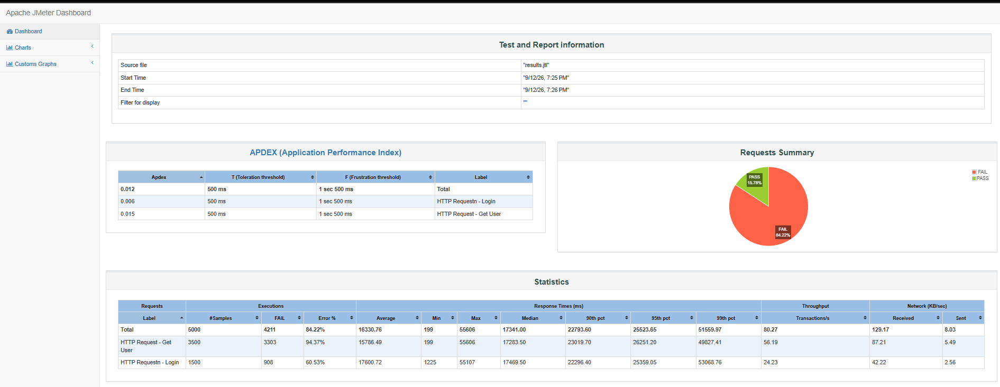
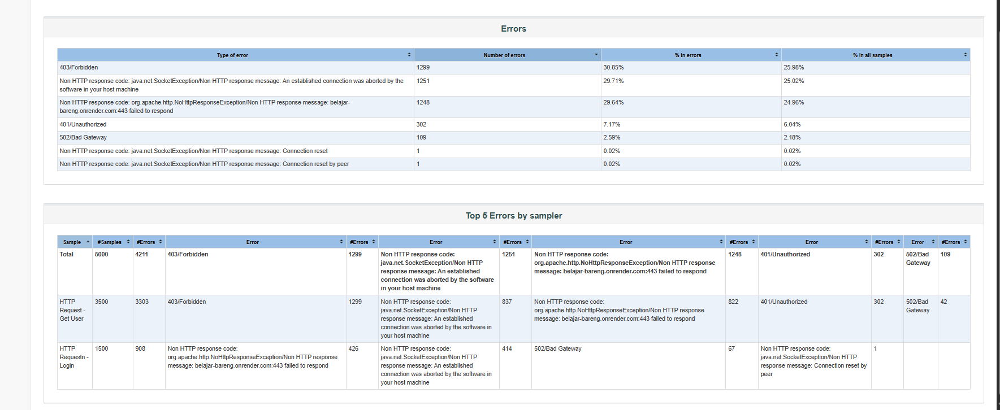

# API Performance & Load Testing Report

**Live Dashboard:** [https://dickyadem.github.io/LoadAndPerformanceTesting/](https://dickyadem.github.io/LoadAndPerformanceTesting/)

Dokumen ini merupakan gabungan dari laporan hasil pengujian beban dan penjelasan struktur test plan JMeter untuk project API Authentication & User Management. README ini berfungsi sebagai ringkasan portofolio yang mudah dibaca, sedangkan file laporan detail tetap tersedia untuk referensi teknis.

## 1. Project Overview

**Project Target:** API Service Authentication & User Management  
**URL:** https://belajar-bareng.onrender.com

**QA / Performance Engineer:** Dicky Ade Mahendra  
**Tools Used:** Apache JMeter 5.6.3, PowerShell, HTML Dashboard Generator  
**Date:** September 2026

## 2. Objective

Tujuan utama dari pengujian ini adalah mengevaluasi:

- Ketahanan aplikasi saat menerima beban pengguna tinggi
- Latensi rata-rata dan puncak respons API
- Batas kapasitas maksimum sistem sebelum terjadi kegagalan
- Efektivitas konfigurasi endpoint login dan get user dalam skenario beban realistik

Pengujian dibuat dengan pola trafik read-heavy, yaitu:

- Login: 30%
- Get Users: 70%

Tujuannya adalah memprediksi bagaimana sistem akan bertahan saat trafik naik secara signifikan di lingkungan produksi.

---

## 3. Test Scenario & Workload Distribution

Skenario pengujian mensimulasikan alur transaksi mulai dari autentikasi hingga pembacaan data profil.

| Endpoint API | Method | Traffic Allocation | Validation |
| --- | --- | --- | --- |
| `/api/login` | POST | 30% | HTTP 200 OK dan ekstraksi token dari response JSON |
| `/api/users` | GET | 70% | HTTP 200 OK dengan header `Authorization: Bearer ${bearer_token}` |

### Load Configuration

- **Stress Test:** 5.000 Virtual Users, Ramp-up 1 detik
- **Normal Load Test:** 100 Virtual Users, Ramp-up 10 detik

---

## 4. Executive Summary

Berdasarkan hasil pengujian, sistem menunjukkan performa yang cukup stabil pada beban normal, tetapi mengalami degradasi berat saat beban tiba-tiba melonjak.

| Metric | Stress Test (5.000 Users) | Normal Load Test (100 Users) | SLA / Target |
| --- | --- | --- | --- |
| Total Samples | 5.000 | 100 | - |
| Error Rate | 84.22% | 0.00% | < 1.00% |
| Average Response Time | 16.330 ms | 753.4 ms | < 2.000 ms |
| Max Response Time | 55.606 ms | 4.778 ms | < 5.000 ms |
| Throughput | 79.2 req/sec | 138.8 req/sec | Target system capacity |

### Key Findings

1. **Stress Test menyebabkan overload serius** dengan gagal 84.22%, terutama akibat lonjakan traffic yang terlalu cepat.
2. **Baseline test stabil** dengan error rate 0.00% dan rata-rata respons tetap berada dalam ambang yang masih dapat diterima.
3. **Latensi awal naik pada login** terutama saat cold-start/SSL handshake pertama kali terjadi.

### Interpretation

Hasil ini menunjukkan bahwa sistem belum sepenuhnya siap untuk trafik burst tinggi tanpa strategi optimasi. Pada tingkat normal, aplikasi masih bisa beroperasi dengan baik, tetapi pada kondisi puncak, beban server dan antrean koneksi perlu ditangani lebih lanjut.

---

## 5. Dokumentasi Hasil Load Testing

### Ringkasan Performa

Gambar berikut menunjukkan ringkasan hasil pengujian JMeter, termasuk APDEX, jumlah request, persentase request gagal, waktu respons, throughput, dan status pengujian.



### Detail Error

Pada detail error, beberapa respons yang perlu diperhatikan adalah `403 Forbidden`, koneksi terputus, `401 Unauthorized`, dan `502 Bad Gateway`. Informasi ini dapat digunakan untuk memeriksa konfigurasi autentikasi, akses endpoint, koneksi jaringan, dan kapasitas server.



---

## 6. Technical Recommendations

Beberapa langkah yang disarankan untuk tim pengembangan adalah:

- **Rate Limiting / Throttling:** Batasi kuota request pada endpoint login agar trafik burst tidak membanjiri server.
- **Caching (Redis):** Terapkan caching untuk endpoint `GET /api/users` untuk mengurangi beban database dan meningkatkan throughput.
- **Autoscaling Optimization:** Sesuaikan aturan HPA agar scale-out terjadi lebih cepat sebelum CPU atau memory mencapai threshold kritis.
- **Monitoring dan Alerting:** Pasang monitoring performa real-time untuk latensi, error rate, CPU, memory, dan jumlah active connection.

---

## 7. CLI Execution Log

### Execute JMeter Test in Non-GUI Mode

```powershell
jmeter -n -t "C:\Users\ASUS\Documents\apache-jmeter-5.6.3\apache-jmeter-5.6.3\backups\LoginAndGetUserr-000005.jmx" -l "C:\Users\ASUS\results.jtl"
```

### Generate HTML Dashboard Report

```powershell
Remove-Item -Path "C:\Users\ASUS\Documents\apache-jmeter-5.6.3\apache-jmeter-5.6.3\html-report\*" -Recurse -Force
jmeter -g "C:\Users\ASUS\results.jtl" -o "C:\Users\ASUS\Documents\apache-jmeter-5.6.3\apache-jmeter-5.6.3\html-report"
```

---

## 8. Struktur Test Plan JMeter

Dokumen ini juga mencakup struktur ideal dari test plan JMeter agar pengujian lebih terorganisir dan mudah dianalisis.

```text
Test Plan
└── Thread Group
    ├── Throughput Controller - Login (30%)
    │   └── HTTP Request - Login
    │       ├── HTTP Header Manager
    │       ├── Response Assertion
    │       ├── JSON Assertion
    │       ├── Assertion Results
    │       └── JSON Extractor
    ├── Throughput Controller - Get User (70%)
    │   └── HTTP Request - Get User
    │       ├── HTTP Header Manager
    │       └── Response Assertion
    ├── View Results Tree
    └── Summary Report
```

### Penjelasan Komponen

#### Test Plan
Test Plan adalah wadah utama dari seluruh konfigurasi JMeter. Semua thread group, controller, samplers, assertions, dan listener berada di dalamnya.

#### Thread Group
Thread Group digunakan untuk menentukan:

- jumlah virtual users
- ramp-up time
- loop count

#### Throughput Controller
Controller ini membatasi porsi request yang masuk ke login dan get user sesuai proporsi trafik yang sudah direncanakan.

#### HTTP Request - Login
Melakukan request `POST /api/login` dengan body JSON, contohnya:

```json
{
  "email": "user@example.com",
  "password": "password123"
}
```

#### HTTP Header Manager
Menambahkan header seperti:

```http
Content-Type: application/json
```

#### Response Assertion
Memastikan status HTTP sesuai ekspektasi, misalnya `200 OK`.

#### JSON Assertion
Memvalidasi isi body response, seperti field `status`, `message`, dan `token`.

#### JSON Extractor
Mengambil token dari response JSON lalu menyimpannya ke variabel seperti:

```text
${bearer_token}
```

Token ini selanjutnya dipakai pada request `GET /api/users`.

#### View Results Tree
Memberikan detail request dan response per transaksi, termasuk headers, body, dan status code.

#### Summary Report
Menampilkan ringkasan metrik seperti:

- samples
- average response time
- min/max
- error percentage
- throughput

---

 
 

## 9. Repository Notes

Project ini mencakup:

- JMeter test plan
- hasil eksekusi `.jtl`
- dashboard HTML hasil report
- dokumentasi performa dan struktur konfigurasi test

Dokumen ini disusun agar mudah dibaca oleh recruiter, 

 